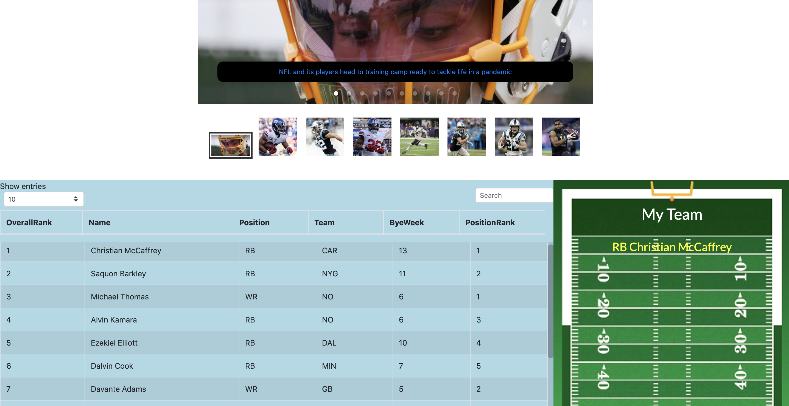

# Fantasy Football App

Fantasy Football is an application that allows it's users to explore all things fantasy football. They can see the most up-to-date news, see all players rankings and previous year stats, and build a team of their own. Users can also ask for advice on who to draft and vote who they believe is the best player.

# What it looks like

# Tools used for this app:

React Js
(You can learn more in the [Create React App documentation](https://facebook.github.io/create-react-app/docs/getting-started).

To learn React, check out the [React documentation](https://reactjs.org/).)

FantasyFootballAPI: 3rd party API for getting football player data and rankings

NewsAPI: 3rd party api used to get fantasy football news based on keywords

Axios: a Javascript library used to make HTTP requests from node.js

# Future Features

- Allowing users to edit and save teams they build
- Allowing users to vote in blog for which player should be drafted
- 12 month calendar feature with dropdown for teams and opponent logo on the date playing them.
- Possible sports trivia section.

# Where the app is hosted.

localhost only at the moment

# How to make it work locally:

1. Fork and clone repo
2. Install all dependencies
3. Create .env file in the root
   - Populate with the following
     - PORT = the port you would like to use
     - SESSION_SECRET = 'any string'
     - MONGODB_URI = 'path to your mongo storage'
4. CD into Backend, seed DB, and type NPM Run Dev
5. CD into Frontend, type NPM Run

# Contributors

@hurl2526 📖

### Contact

If you want to contact me you can reach me at patrick.hurley@codeimmersives.com
